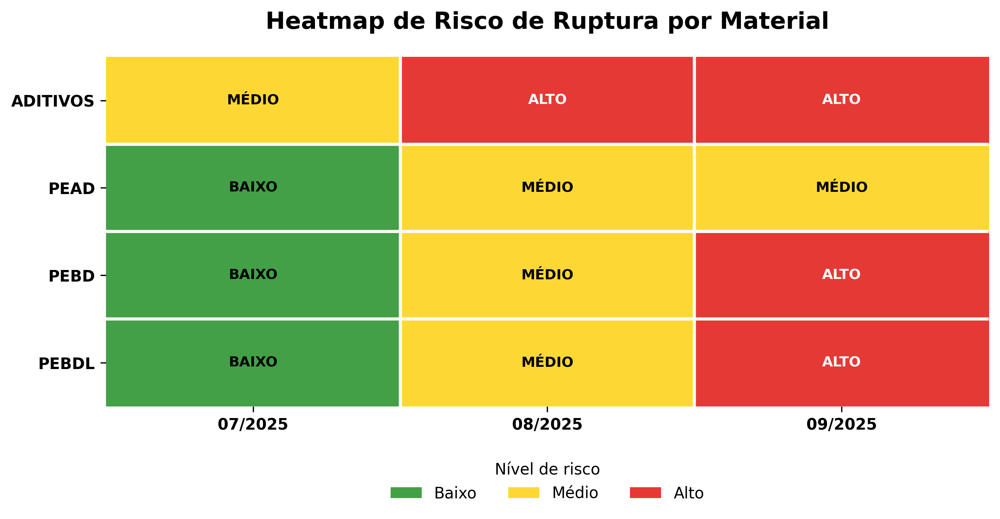
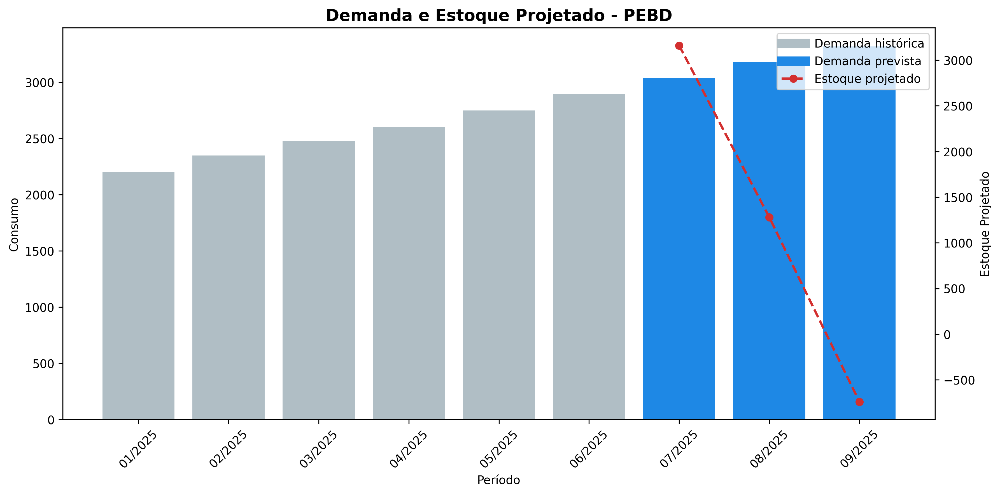

# Forecast de Materiais Industriais


---

## Sobre o Projeto

Sistema desenvolvido em Python para previsão de consumo de materiais industriais, com foco em apoiar áreas de:

- Planejamento de Produção  
- Supply Chain  
- Compras  
- Gestão de Estoque  
- Prevenção de Rupturas  

A aplicação utiliza dados históricos para projetar consumo futuro, estimar estoque e classificar automaticamente materiais com risco de falta.

---

## Problema de Negócio Resolvido

Em ambientes industriais, decisões de compra tardias podem gerar:

- Paradas de produção  
- Custos emergenciais  
- Compras urgentes  
- Ruptura de estoque  
- Falta de visibilidade futura  

Este projeto antecipa esses cenários por meio de previsões simples e indicadores visuais.

---

## Funcionalidades

- Leitura de base CSV histórica  
- Tratamento e validação dos dados  
- Forecast de consumo por material  
- Projeção de estoque futuro  
- Classificação de risco de ruptura  
- Heatmap executivo de criticidade  
- Gráficos automáticos por material  
- Exportação CSV com resultados

---

## Materiais Simulados

- PEAD  
- PEBD  
- PEBDL  
- ADITIVOS  

---

## Exemplo de Heatmap de Risco

Verde = Baixo | Amarelo = Médio | Vermelho = Alto

```text
ADITIVOS  MÉDIO  ALTO   ALTO
PEBD      BAIXO  MÉDIO  ALTO
PEBDL     BAIXO  BAIXO  ALTO
PEAD      BAIXO  BAIXO  MÉDIO


## Resultados Visuais

### Heatmap de Risco



### Forecast de Demanda


